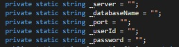

# FoodOrderAutomation
Проект, выполненный в рамках дисциплины "Проектный практикум" от УРФУ.   
**Цель:** автоматизация заказа питания в школах.  
**Заказчик:** филиал “Екатеринбургский” Акционерного общества “Альфа-Банк” в г.Екатеринбурге.

  

**Предисловие**
=====================
***Продукт предоставлен в ознакомительных целях и не подходит для общественного использования.***  
Времени на изучение материала и разработку продукта было выделено чуть меньше ***двух месяцев***. Из-за этого имеются проблемы, которые препятствуют общественному использованию продукта:  
1. Синхронность большинства операций взаимодействия с БД
2. Реализация соединения с БД напрямую, а не через веб-сервис. Это небезопасно
3. Код написан в свободном стиле. Не выдержан паттерн разработки **MVVM**, присущий Xamarin  

 Наше решение создано, чтобы показать, как может выглядеть реализация идеи заказчика. Вы можете использовать созданные нами дизайн и структуру базы данных для создания своего приложения (только не используйте логотип Альфа-Банка). Использовать код или ориентироваться на него ***не рекомендуется***.

  

**Начало работы**
=====================
1. Импортируйте базу данных из дампа ***dump.sql*** на свой сервер.
2. Откройте проект, выберите DatabaseInfo.cs  
3. Внесите данные, необходимые для подключения к БД  

    
    
4. Запустите приложение, войдите в профиль используя логин ***test*** и пароль ***test*** (профиль со всем функционалом)
5. Создавайте и редактируйте меню/пользователей/классы. 

  

**База данных**  
=====================
* Вы можете менять названия ролей в таблице ***roles_description***, но не меняйте их смысл/идентификатор/количество (настроено за вас)
* Для редактирования уведомлений в таблице ***notifications*** должна быть одна запись любого содержания. Новые записи не добавляются, редактируется существующая
* Вы можете менять названия разделов в таблице ***dish_categories***, но не меняйте их смысл/идентификатор/количество (настроено за вас)
* Для корректной работы через приложение, в таблицах ***user_menus***, ***user_info***, ***balance*** должна быть запись минимум об одном пользователе (настроено за вас)
* Вносить большинство модификаций в базу данных лучше через приложение.

Возможно, здесь появится подробное описание структуры каждой таблицы из базы данных.  

  

**Функционал**  
=====================  
* Создание/редактирование пользоваталей
* Создание/редактирование классов
* Создание/редактирование общего списка блюд
* Создание/редактирование списка блюд на выбранную дату
* Создание/редактирование индивидуальных пользовательских меню
* Создание связи родитель-ребёнок для переключения на дочерние профили из основного
* Возможность отмечать присутсвующих детей для подачи заявки в столовую
* Просмотр краткого/подробного отчёта по необходимому количеству блюд
* Создание уведомлений от персонала  

Демонстрация функционала
-----------------------------------

 
 

**Над проектом работали**  
=====================  
1. Межин Матвей - разработчик
2. Костарева Анна - дизайнер
3. Хярмасте Даниил - аналитик
4. Нурмухаметова Екатерина - тимлид

**Лицензия**  
===================== 

The MIT License

Permission is hereby granted, free of charge, to any person obtaining a copy
of this software and associated documentation files (the "Software"), to deal
in the Software without restriction, including without limitation the rights
to use, copy, modify, merge, publish, distribute, sublicense, and/or sell
copies of the Software, and to permit persons to whom the Software is
furnished to do so, subject to the following conditions:

The above copyright notice and this permission notice shall be included in
all copies or substantial portions of the Software.

THE SOFTWARE IS PROVIDED "AS IS", WITHOUT WARRANTY OF ANY KIND, EXPRESS OR
IMPLIED, INCLUDING BUT NOT LIMITED TO THE WARRANTIES OF MERCHANTABILITY,
FITNESS FOR A PARTICULAR PURPOSE AND NONINFRINGEMENT. IN NO EVENT SHALL THE
AUTHORS OR COPYRIGHT HOLDERS BE LIABLE FOR ANY CLAIM, DAMAGES OR OTHER
LIABILITY, WHETHER IN AN ACTION OF CONTRACT, TORT OR OTHERWISE, ARISING FROM,
OUT OF OR IN CONNECTION WITH THE SOFTWARE OR THE USE OR OTHER DEALINGS IN
THE SOFTWARE.

